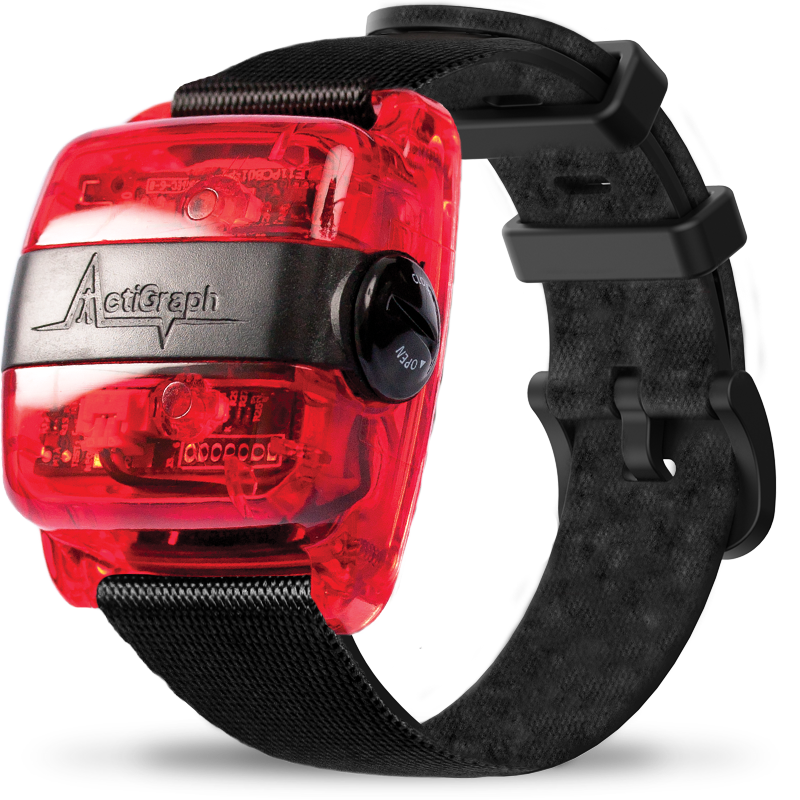
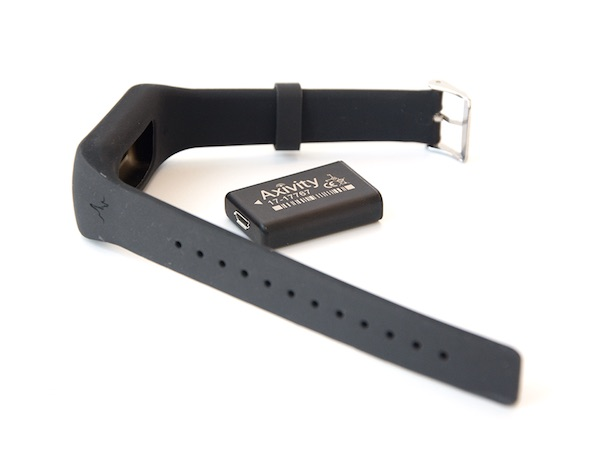
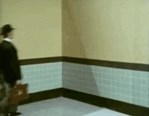

```{r setup, include = FALSE}
library(knitr)
library(hms)
library(lubridate)
library(dplyr)
knitr::opts_chunk$set(echo = FALSE)
```

# Materials

Materials are at: https://github.com/jhuwit/wearabler

Can use `git clone` or download via: https://github.com/jhuwit/wearabler/archive/refs/heads/main.zip

# Why Measure Activity?

- Physical activity important component of health and contributes to assessing and predicting mortality risk [@pa_benefits]

- Objective assessment in free-living settings - more accurate than self-report [@Prince2008].  

- Shown as strongest predictor of mortality [@tabacu2020quantifying] 

# Goals

Go from this
{.r-stretch}
to this
day level counts and labeled


# Goal

Go from this
{.r-stretch}
to this


# Main Question

What does an accelerometer measure?

::: {.incremental}

* Piezoelectric sensor - material generates an electric charge from mechanical stress/movement
* Capacitive micro-electro-mechanical system (MEMS) - mobile spring suspended mass with multiple capacitance plates

:::

# The Device Landscape

**Commercial** wearables (watches and fitness trackers) - designed for consumer experience. 

  - Proprietary step, sleep, or activity scores
  - Raw signal and processing rules may be unavailable or change over time.

**Research grade** - for studies

- High-frequency raw acceleration and device metadata
- Trade off - decide on calibration, QC, and alternative processing


# Example Studies

- **NHANES Accelerometry (CDC)** (2003-2006, 2011-2014)
- Large-scale population studies using wrist-worn devices
- Released raw data - we released processed version
- **UK Biobank Wearable Data**
- Over 100,000 participants with 7-day wrist accelerometer recordings
- All of US uses FitBit


# Accelerometers Covered

:::: {.columns}

::: {.column width="55%"}

- ActiGraph wGT3X+ (pictured)/GT9X: `.gt3x` extension (NHANES)
- Axivity AX3: `.cwa` file (UKBiobank)

This is a research-grade, tri-axial accelerometer—not a consumer step counter.
:::

::: {.column width="22.5%"}
{fig-alt="ActiGraph wGT3X-BT research accelerometer on a wrist strap" width="85%"}

<small>ActiGraph wGT3X-BT. Image: [Ametris](https://ametris.com/actigraph-wgt3x-bt).</small>
:::

::: {.column width="22.5%"}
{fig-alt="Axivity AX3 research accelerometer with a wrist band" width="100%"}

<small>Axivity AX3. Image: [Axivity](https://axivity.com/product/ax3).</small>
:::

::::


# What is Raw Accelerometer Data?

- **Sensor that measures acceleration** in 3D space: X/Y/Z
- Typically measured in **g-forces (g, $g=9.81m/s^2$)** or **m/s²**
- Sampled at regular(ish) time intervals (e.g., 30Hz, 100Hz)

```plaintext
Timestamp                  X        Y        Z
2025-02-17 12:00:00.0125   0.02     0.98     0.03
2025-02-17 12:00:00.0250   0.04     0.95     0.05
2025-02-17 12:00:00.0375  -0.01     0.99     0.02
```


# Wrist-Worn vs. Hip-Worn Accelerometers

| Feature       | Wrist-Worn Devices  | Hip-Worn Devices  |
|--------------|------------------|-----------------|
| Placement    | Worn on wrist    | Attached to belt |
| Compliance   | Higher           | Lower           |
| Activity Types | Captures arm movements | Better for whole-body movement |


# Data Resolution

- **Raw Accelerometer Data** (high-resolution time-series)
  - 20-100+ samples/second (Hz)
- **Wear Time Detection** (non-wear vs. wear periods)
- Minute Level 
  - **Activity Counts**, **Activity Index**, **ENMO**, **MAD**
  - **Steps** (estimation of a "step")
- Sleep estimation

{.r-stretch}


# Course Learning Goals

- Read in accelerometry data
- Visualize the data
- Calculate minute-level summaries 
- Calculate non-wear and inclusion
- Create daily summaries
- Discuss functional approaches

# Packages

This work is based off the [`activerse`](https://github.com/jhuwit/activerse), which is maintained by Johns Hopkins Wearable and Implantable Technology (WIT) group, with code at https://github.com/jhuwit.

If you can't find a package, try `pak::pkg_install("jhuwit/PACKAGE")`, such as

- `pak::pkg_install("jhuwit/asleep")`
- `pak::pkg_install("jhuwit/activerse")`


# References
