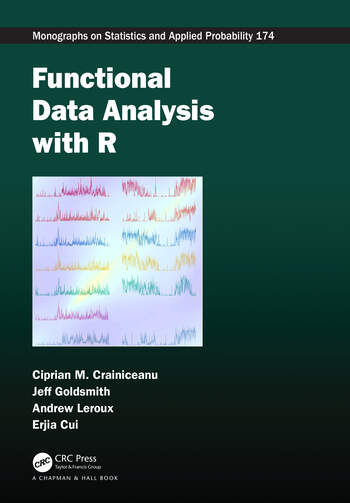

```{r setup, include = FALSE}
library(knitr)
library(tidyverse)
library(targets)
library(activerse)
library(arctools)
library(runstats)
options(digits.secs = 3)
knitr::opts_chunk$set(echo = FALSE)
tar_load(data_gt3x)
```


```{r}
tar_load(measures)
tar_load(data_proc)
```


# Weekend Warrior

From @shiroma2019physical

Within each MVPA category 

- inactive: <37.5 minutes
- insufficiently active: 37.5-<150 minutes
- sufficiently active: ≥150 minutes per week

Weekend warriors: accrued ≥ 50% of their weekly MVPA on only one or two days, and "regularly active" participants who spread their activity over the entire week. 

# Population Data

Subset of 100 people, multiple days from [NHANES AC data](https://physionet.org/content/minute-level-step-count-nhanes/1.0.1/csv)

```{r}
#| echo: true
wide = readr::read_rds(here::here("data/ac_subset_wide.rds"))
head(wide)
```


# Average Day per Person

We reshaped it so each time is a minute and then thresholded average minute (not really "correct"):

```{r}
#| echo: true
#| eval: false
df = wide |>
  pivot_longer(starts_with("min_"), names_prefix = "min_", names_to = "minute")
df = df |>
  group_by(SEQN, minute) |>
  summarise(value = mean(value, na.rm = TRUE)) |>
  ungroup() |>
  mutate(minute = as.numeric(minute) - 1,
         minute = hms::hms(minutes = minute),
         time = ymd_hms(paste0("2000-01-01", " ", as.character(minute)),
                        tz = "UTC"))

df = df |>
  select(SEQN, time, value)
df = df |>
  arrange(SEQN, time)
df = df |> 
  mutate(mvpa = cut(value, breaks = c(0, 2860, 3940, Inf),
                    include.lowest = FALSE, 
                    labels = c("sedentary", "light", "mvpa")))
head(df)
```

```{r long_ac}
#| echo: false
#| eval: true
df = readr::read_rds(here::here("data/ac_subset.rds"))
head(df)
df = df |> 
  mutate(mvpa = cut(value, breaks = c(0, 2860, 3940, Inf), 
                    include.lowest = FALSE, 
                    labels = c("sedentary", "light", "mvpa")))
# df = df |> 
#   filter(SEQN %in% unique(df$SEQN)[1:10])
```

# Plotting Population

Plotting one row per person (100 people):

```{r}
#| echo: true
df |> 
  mutate(SEQN = as.numeric(factor(SEQN))) |> 
  ggplot(aes(x = minute, y = SEQN)) + 
  geom_tile(aes(fill = mvpa)) + 
  ylab(NULL) + 
  theme(axis.ticks.y = element_blank(),
        axis.text.y = element_blank())
```

# Lasagna Plot

@swihart2009lasagna stacks the data into layers

```{r lasagna_show}
#| echo: true
#| eval: false
#| cache: true
res = ggplot2::resolution(df$minute)
df |> 
  ggplot(aes(x = minute)) + 
  geom_bar(aes(fill = mvpa), position = "stack", width = res) + 
  guides()
```

# Lasagna Plot

```{r lasagna_run}
#| dependson: lasagna_show
#| echo: false
#| out-width: "100%"
<<lasagna_show>>
```

# General Lasagna Function

```{r}
#| echo: true
#| eval: false
geom_lasagna = function(data, x, ..., position = "stack") {
  xvar = rlang::enquo(x)
  x_string = rlang::as_label(xvar)
  xvalues = data[[x_string]]
  if (hms::is_hms(xvalues)) {
    xvalues = as.numeric(xvalues)
  }
  res = ggplot2::resolution(xvalues)
  data %>%
    ggplot2::ggplot(aes(..., x = !!xvar)) +
    ggplot2::geom_bar(position = position, width = res)
}
```

# Quantile Mapping

- [`actiquantiles`](https://github.com/jhuwit/actiquantiles)
- Map your data into NHANES quantiles (and by age/sex)

```{r}
library(actiquantiles)
example_data <- data.frame(
  id = 1:2,
  age = c(25, 62),
  sex = c("Female", "Male"),
  measure = c("mims", "ssl_steps"),
  value = c(15000, 7500)
)

acti_map_nhanes(example_data)
```

# Analysis

# Mean Analysis

* Inclusion criteria per day
* Person inclusion by number of days
* Mean over days - one measure per person
* Standard statistical framework

# FUI Analysis

* FUI - Fast univariate inference for longitudinal functional models @cui2022fast
* `fastFMM` package 

1. fit massively univariate pointwise mixed effects models
2. apply a smoother along the functional domain
3. obtain joint confidence bands (usually bootstrap)

```{r}
#| echo: true
#| eval: false
wide = readr::read_rds(here::here("data/ac_subset_wide.rds"))
head(wide)
wide = wide[rowSums(is.na(wide |> select(starts_with("min")))) == 0,]
# does not like tibbles
wide = as.data.frame(wide)
fit_data <- fastFMM::fui(
  min ~ PAXDAYWM + (1 | SEQN),
  data = wide
)
```

# FDA Packages

* [`refund`](https://github.com/refunders/refund) package
* [`tidyfun`](https://tidyfun.github.io/tidyfun/)
* [`fda`](https://cran.r-project.org/web/packages/fda/index.html)

# Function on Scalar Regression

Large generalized additive model (`mgcv`)

- y - scalar outcome
- functional effect for minute, by age, sex

```{r}
#| echo: false
#| eval: false
fit <- bam(
  y ~
    s(minute, bs = "cc", k = 24) +             # population mean 24-hour curve
    s(minute, by = age_category, bs = "cc", k = 24) + # age effect varies over day
    s(minute, by = sex, bs = "cc", k = 24) +# female–male difference over day
    s(SEQN, bs = "re"),                        # participant random intercept
  data = minute_data,
  method = "fREML",
  discrete = TRUE,
  knots = list(minute = c(0.5, 1440.5))
)
```


# Survey Weighting

- @smirnova2024scalar [`surveySoFR`](https://github.com/andrew-leroux/surveySoFR) - scalar on function 
- @koffman2025function [`svyfosr`](https://github.com/jhuwit/svyfosr) - function on scalar
  - FUI with `survey` package


# FDA Book

https://www.routledge.com/Functional-Data-Analysis-with-R/Crainiceanu-Goldsmith-Leroux-Cui/p/book/9781032244716


{.r-stretch}


# Modules
[https://jhuwit.github.io/wearabler/modules](https://jhuwit.github.io/wearabler/modules)

# References
