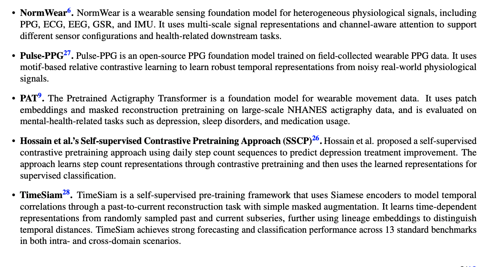

```{r setup, include = FALSE}
library(knitr)
library(tidyverse)
library(targets)
library(activerse)
library(arctools)
library(runstats)
options(digits.secs = 3)
```

# AI

- Large opportunity for Self-Supervised Learning
- Easy to collect, may be hard to characterize

# Foundation Models

---

## Inertia-1
- Inertia-1 - foundation model from NHANES+UKBB raw data
- https://yang-ai-lab.github.io/Inertia-1/
- https://arxiv.org/abs/2607.06617
- https://github.com/yang-ai-lab/Inertia-1#pretraining-data-nhanes

## SensorFM 
Google using FitBit/Pixel Watch:
- https://research.google/blog/sensorfm-towards-a-general-intelligence-and-interface-for-wearable-health-data/
  
## StepFM 
- Step Foundation Model
 - https://arxiv.org/pdf/2607.06954

## PAT

- Pretrained Actigraphy Transformer 
  - patch embeddings and masked reconstruction pretraining on large-scale NHANES actigraphy data, 
  - evaluated on mental-health-related tasks such as depression, sleep disorders, and medication usage.
- Based on full 7 days (10080 vector)


## Landscape

From the StepFM model paper:
{.r-stretch}


# Modules
[https://jhuwit.github.io/wearabler/modules](https://jhuwit.github.io/wearabler/modules)


# References
